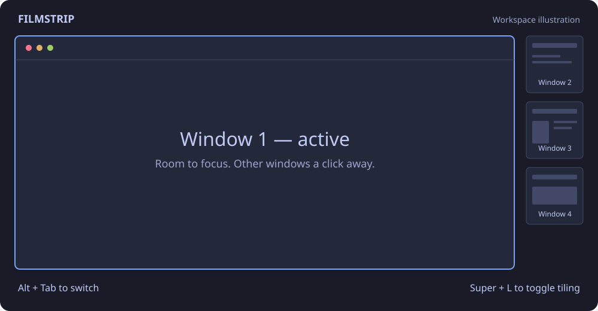

# Filmstrip for Omarchy

[](https://github.com/tcballard/omarchy-badges)

One large window. A strip of real window previews. Switch without reshuffling your workspace.

Filmstrip gives the active window 90% of the screen and puts clickable miniature
views of the workspace's other windows in the remaining 10%. Use **Alt+Tab** or click a
preview to switch. With only one tiled window, the strip disappears and the
window gets the full available space.



An independent community extension for Omarchy, licensed under MIT. It combines
Hyprland's native **monocle** layout with an Omarchy shell plugin. It does not
modify packaged files in `/usr/share/omarchy`.

## Features

- Real compositor-captured previews of other windows; the main window is omitted.
- **Super+L** toggles Filmstrip and the previous layout independently per workspace.
- **Alt+Tab / Alt+Shift+Tab** cycle in thumbnail order.
- Theme-aware cards, a transparent sidebar, and optional header/footer text.
- Sidebar hides for a single tiled window, fullscreen, or an active special workspace.
- Floating windows remain floating; the strip lists tiled windows.
- Layout choices survive configuration reloads and login.

## Requirements

Tested with **Hyprland 0.56.2** and **Quickshell 0.3.1** on Omarchy's **Lua-based
Hyprland configuration and plugin-capable Quickshell shell**. Older Omarchy
versions using `hyprland.conf` or Waybar are not supported by this installer.
Python 3.10+ and Git are needed to install.

This is an early release. The shell plugin uses Omarchy's shared `Color` and
`Style` APIs, so future shell changes may require updates. Monitor-specific
panels are implemented; live validation so far covers one monitor. Some apps
throttle background rendering or cannot provide a preview.

## Install

Run as your regular desktop user, **without sudo**:

```sh
git clone https://github.com/mikeytag/omarchy-filmstrip.git
cd omarchy-filmstrip
python3 install.py --dry-run
python3 install.py
```

The installer copies the plugin and controller, enables the plugin, adds layout
menu entries, and replaces **Super+L**, **Alt+Tab**, and **Alt+Shift+Tab** with
Filmstrip-aware shortcuts. It backs up every changed file, reloads Hyprland,
checks configuration errors, and restarts the Omarchy shell.

Filmstrip becomes the default layout. Existing explicit workspace layout choices
are preserved; press **Super+L** in those workspaces to enable it. To keep your
current default and opt in per workspace instead:

```sh
python3 install.py --no-default
```

Additional options:

- `--no-menu`: preserve the existing menu unchanged, including conflicting layout entries.
- `--no-reload`: write files only; then run `hyprctl reload`, `hyprctl configerrors`, and `omarchy restart shell` yourself.
- `--dry-run`: validate configuration and list planned files without writing anything.

The installer preserves unrelated configuration values. It reformats the menu
JSONC and shell JSON, removing comments; the originals are in the printed backup
folder. Review that backup if you need to retain your comments.

## Use

| Shortcut | Action |
| --- | --- |
| Super+L | Toggle Filmstrip / previous workspace layout |
| Alt+Tab | Next window |
| Alt+Shift+Tab | Previous window |
| Click a preview | Select that window |

You can also use **Omarchy menu → Style → Window Layout**, or:

```sh
~/.local/bin/omarchy-filmstrip enable
~/.local/bin/omarchy-filmstrip disable
~/.local/bin/omarchy-filmstrip layout dwindle
~/.local/bin/omarchy-filmstrip status
```

Filmstrip uses native `monocle`, so Hyprland reports that layout name. The
controller and menu display it as `filmstrip`. Selecting native monocle also
shows the strip while the plugin is enabled.

## Appearance

Edit the Filmstrip entry in `~/.config/omarchy/shell.json`:

```json
{
  "id": "mtaggart.filmstrip",
  "showHeader": false,
  "showFooter": false,
  "backgroundOpacity": 0
}
```

These are the installer defaults. Header and footer become visible if their
settings are omitted. Set `backgroundOpacity` between `0` (transparent) and `1`
(solid theme background). Changes apply live. Cards and selection borders follow
the active Omarchy theme. The plugin ID remains `mtaggart.filmstrip` for
compatibility with early installations.

## Update and undo

Update from your checkout, using the same installation options you originally chose:

```sh
git pull --ff-only
python3 install.py
```

Every installation that changes files prints a backup directory under
`~/.local/state/omarchy/filmstrip/install-…`. To undo that installation:

```sh
python3 install.py --restore /path/to/the/printed/backup
```

Rollback restores previous files and removes newly created files. It refuses to
overwrite files edited since installation; in that case, merge the originals
from the backup's `files/` directory manually. A backup from an update restores
the prior installed version. For complete removal, use the original installation
backup or follow the manual steps below.

Before uninstalling, select **Tiling** in any workspace where you enabled
Filmstrip after installation. These saved workspace choices are separate from
installation backups. For manual removal, disable `mtaggart.filmstrip` with
`omarchy plugin disable mtaggart.filmstrip`, remove the Filmstrip require from
`hyprland.lua`, remove the managed Filmstrip block in `bindings.lua` and the
Filmstrip layout-menu entries, and remove the plugin directory, controller, and
`hypr/filmstrip.lua`. Reload Hyprland, check `hyprctl configerrors`, and restart
the shell. Restore any previous custom shortcuts from your backup.

## How it works

Native monocle displays one tiled window and blocks input to inactive windows.
This matters: merely stacking full-size Lua layout targets can render one window
while sending mouse clicks to a different window underneath it.

The Quickshell panel reserves 10% of the monitor's logical width using a
layer-shell exclusive zone. `ScreencopyView` captures each full-size window via
Hyprland's toplevel export protocol. Previews preserve aspect ratio and refresh
roughly every 750 ms, or 150 ms while hovered. Off-screen cards pause periodic
capture; inactive workspaces release their capture sources. No screenshots are
written to disk by the plugin.

The Python controller validates window addresses, serializes repeated commands,
and saves per-workspace layout rules. Window order is stable by address for the
lifetime of those windows. If the shell stops, its reserved space disappears and
the selected window can use the available area.

## Development and troubleshooting

Run the installer tests without a desktop session:

```sh
python3 -m unittest discover -s tests -p 'test_*.py' -v
```

For live capture, focus, and real pointer/click regression tests, see
[the testing guide](docs/testing.md). These tests interact with your desktop;
run click tests only on disposable test windows.

Useful diagnostics:

```sh
hyprctl configerrors
hyprctl workspaces -j
omarchy-shell filmstrip status
```

Report bugs at [GitHub Issues](https://github.com/mikeytag/omarchy-filmstrip/issues).
Include Hyprland/Quickshell versions, monitor scale and arrangement, and steps to
reproduce. Review diagnostic output before sharing: window addresses and
workspace information can appear, and other Hyprland commands may include titles.
